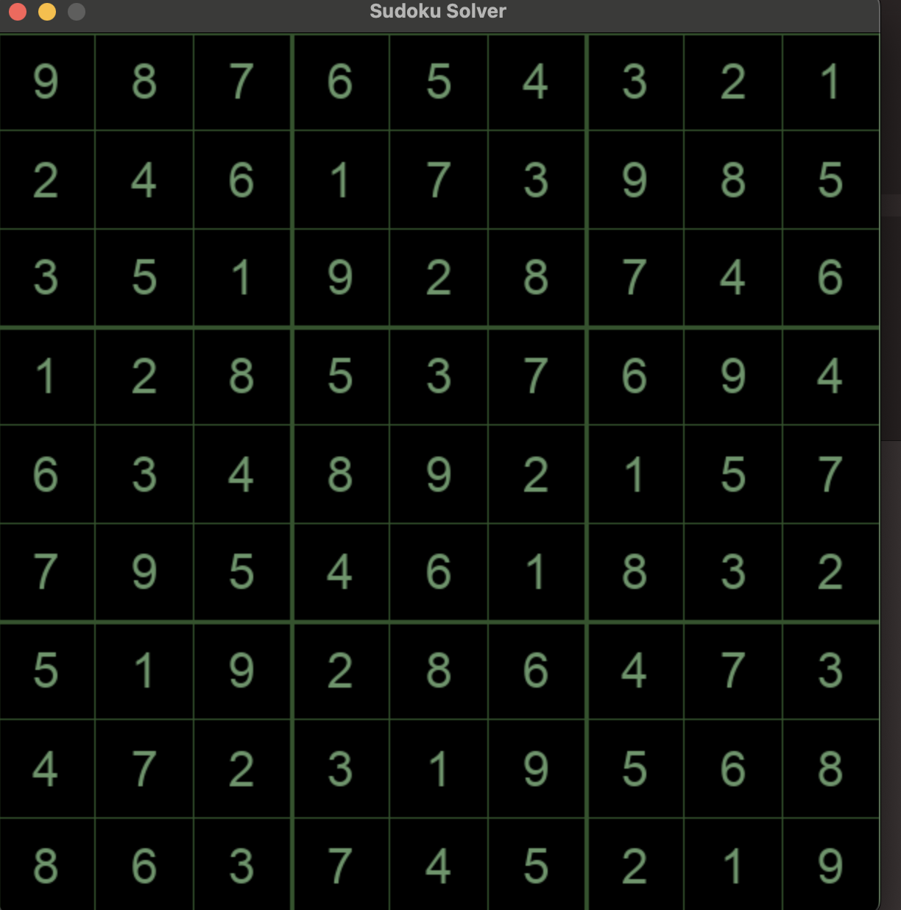

# Sudoku Solver using Dancing Links (DLX) in C++

This project implements a Sudoku solver using Donald Knuth's **Dancing Links (DLX)** algorithm, based on the **Algorithm X** technique. The solver converts Sudoku puzzles into an exact cover problem and uses DLX to find valid solutions efficiently.

## Features

- Solves standard 9x9 Sudoku puzzles.
- Implements the Dancing Links (DLX) algorithm.
- Converts Sudoku constraints into a cover matrix.
- Fast and memory-efficient backtracking.

## Files

- `main.cpp` – Entry point that loads and solves Sudoku puzzles.
- `incidenceMatrix.cpp` – Converts Sudoku puzzles into exact cover matrix.
- `dlxSolver.cpp` – Dancing Links implementation.
- `sudokuHelper.cpp` – Helper functions for input/output and validation.
- `headers` - Holds the necessary classes to make everything work

## How to Build

You can compile using `g++`:

```bash
g++ -std=c++17 -g -O0  -I ./headers ./src/sudokuHelper.cpp  ./src/IncidenceMatrix.cpp ./src/dlxSolver.cpp ./src/main.cpp  -o dlxmain
```
This command is somewhat platform dependent. But should work on all clang/llvm compilers. For more info. refer to this [Website]((https://en.wikipedia.org/wiki/List_of_compilers#C++_compilers))

Then run the build file as follows in terminal. `./dlxmain`. 

## More Sudoku DLX information

For more information on Sudoku Dancing Links, I wish you great adventures into this lovely paper. Even though it was fun to implement and learn a lot about Object Orientation & debugging, it still was a wild ride. 

[Donald Knuth's DLX Paper](https://arxiv.org/abs/cs/0011047)

[Exact Cover Problem](https://en.wikipedia.org/wiki/Exact_cover)

## Check out this! SudokuPyGame
Also check out my sudoku pygame program built using python. This is where I first implemented the algorithm 



[SudokuPyGame](https://github.com/lhalcomb/SudokuPyGame)


